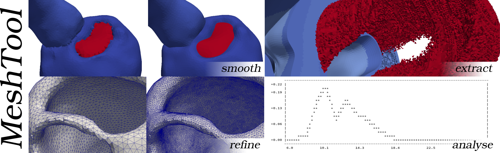
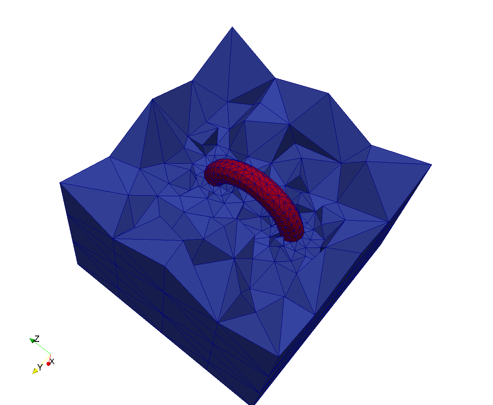
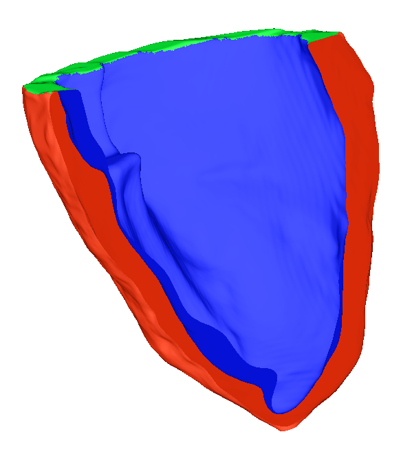

# Advanced Workflows

## Combining multiple meshes into one

In this workflow we will combine the mesh of a torus and one of a cube into one combined
volumetric discretization, where the torus is submerged in the cube. We want both domain to be
resolved according to the input mesh resolutions and to be distinguished by provided
region tags. Note that the torus and cube may only be defined as surfaces,
for example originating from a 3D modeling program.

Let's assume the torus surface is provided in `torus.vtk` and the cube surface in `cube.vtk`.
For volumetric meshes, the user can extract the surfaces with `meshtool extract surface` while
also specifying an mesh output format with the `-ofmt` option.
Also, the surfaces can be provided in any file format readable by meshtool.

We can generate the volumetric mesh with:

        meshtool generate mesh -surf=cube.vtk,torus.vtk -outmsh=cube.torus.vtk -ins_tag=0,100

The surfaces provided with `-surf` have to be ordered from the most outer surface to the
most inner one. Therefore, in our case the cube comes before the torus. Also, the element
tags have to be ordered according to the surfaces.

The next image shows a cut through the input surfaces:

And now a cut (crinkle clip to preserve element forms) through the final volumetric mesh:

## Extracting surfaces and mapping onto submeshes

In this workflow we will extract a set of surfaces from a particular mesh composed of multiple
materials (defined by differing element tags) and map these extracted surfaces onto a sub-mesh,
itself created by extracted one specific material from the full mesh.
The specific example is of a full mesh composed of a left ventricle (element `tag=2`),
the blood pool (element `tag=3`), and the valve plane (element `tag=4`).
The surrounding material is defined as bath with element `tag=0`.

We can extract the LV myocardium from the full mesh with:

	meshtool extract mesh -msh=pig -tags=2 -submesh=pigmyo

The use of all material tags in the full mesh allows us to conveniently define specific surfaces.
For example, the LV epicardial surface is defined as the intersection of the bath and the LV myocardium,
the endocardial surface as the intersection of the blood pool and the LV myocardium,
whilst the base of the LV is defined as the intersection of the LV myocardium and the valve plane.

	meshtool extract surface -msh=pig -surf=EPI,ENDO,BASE -op=2:0;2:3;2:4

These surfaces are defined on the original mesh.
Once the surfaces are extracted, they can be mapped back to the sub-mesh, making use of the stored
files which define the mapping between meshes.

	meshtool map -submesh=pigmyo -files=EPI.surf.vtx -outdir=myo/

Note that only the sub-mesh is given; `meshtool` automatically locates the corresponding `.nod` file
which describes the mapping of nodes between the sub-mesh and its parent mesh from where it was extracted.
The mapped surfaces are saved in the previously created directory `myo/`.

The image below shows the mapped surfaces on the extracted sub-mesh, with epicardium red, endocardium
blue and base green.

## Defining fibres and re-inserting back into meshes

In this workflow we will make use of the method for extracting a sub-mesh and corresponding mapped surfaces
described above and show how fibres can be added and then re-inserted into the parent mesh.
The specific example is for a whole torso model  where all of the other organs and tissues have different
element tags, but importantly the tag of the ventricles is `tag=2`.
The goal is to construct a torso mesh with fibre orientation assigned, such that it might be used to simulate
ventricular activation sequences and compute a realistic simulated ECG.

Firstly, the sub-mesh of the ventricles (called `ventricles`) is extracted from the full torso mesh (called `torso`)

	meshtool extract mesh -msh=torso -tags=2 -submesh=ventricles

as well as the extraction and subsequent mapping of the epicardial, endocardial and base surfaces in a similar manner to the workflow above.
For example

	meshtool extract surface -msh=torso -surf=LVENDO -op=2:3

	meshtool map -submesh=ventricles -files=LVENDO.surf.vtx

where again the blood pool has a `tag=3` and the LV ventricular tissue a `tag=2`.

Following this, fibre orientation is assigned to the fibre file of the sub-mesh using a method based on Bayer et al (2012).
Once assigned, this fibre file must be re-inserted into the full parent mesh

	meshtool insert submesh -submsh=ventricles -msh=torso -outmsh=torsoWithFibres

Here, we have saved our output to a mesh called `torsoWithFibres`.

## Defining scarred regions and re-inserting back into meshes

In this workflow we will discuss defining regions of generic scar to the ventricles via tags, which can then be
re-inserted into a full torso model in a similar manner to the workflow above for the case of fibres.
Scar can be easily mapped between two ventricular models using the Universal Ventricular Coordinate system (UVC),
as described in Bayer et al (2018), which has to first be computed on both meshes.
The computation of UVC is most easily done on just the ventricular mesh, which has been extracted from the whole torso mesh,
similarly to above.
Computation of the UVC requires similar surface definitions as the computation of fibres, mapped over to the
extracted ventricular mesh.

The scarred region is defined in the extracted mesh by altering the tags of the scarred region.
These altered tags can then be re-inserted back into the corresponding ventricular elements in the full torso mesh in a similar
manner to the re-insertion of the fibres in the example above.

	meshtool insert submesh -submsh=ventricles -msh=torso -outmsh=torsoScar

