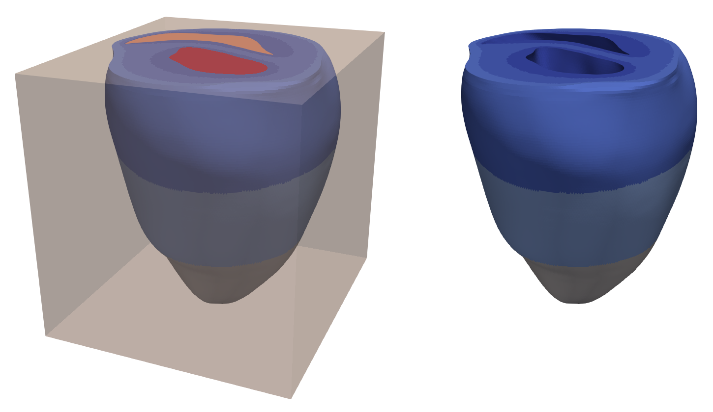
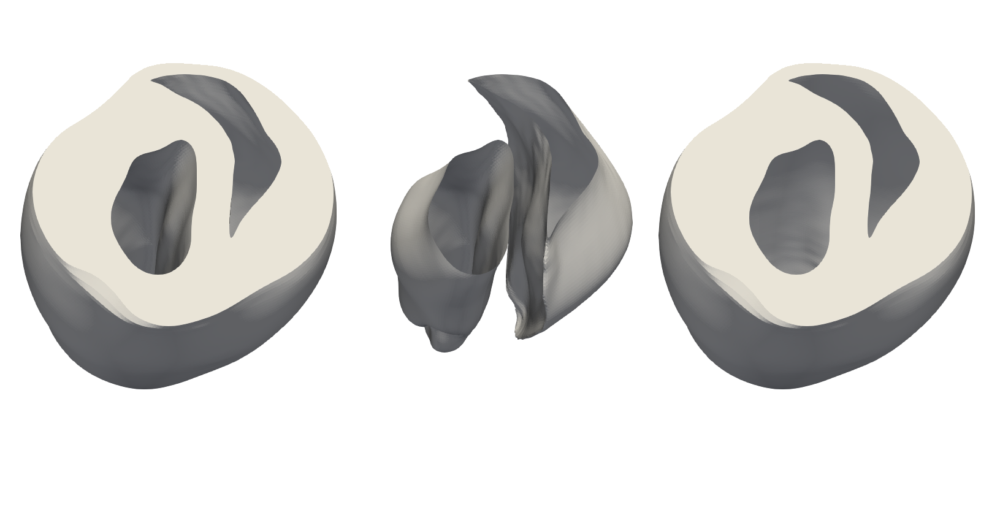
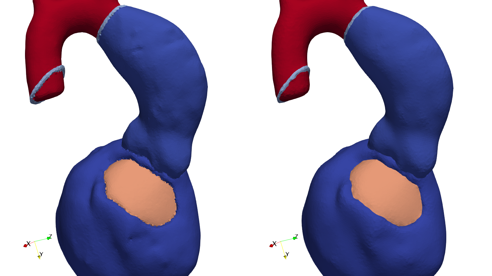
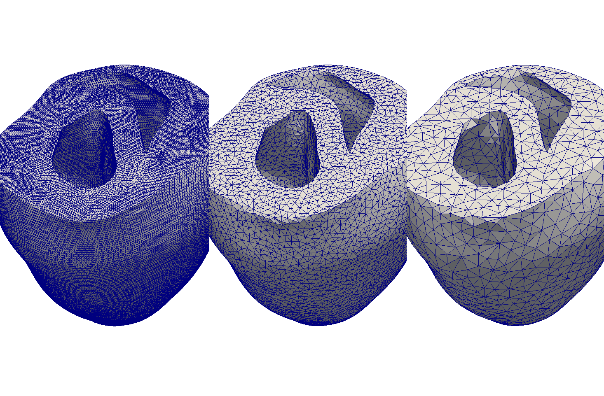

Meshtool - A mesh manipulation utility
======================================

## Introduction

Meshtool is a comand-line tool written in C++. It is designed to apply various
manipulations to volumetric meshes. The mesh manipulations are referred to as
"meshtool modes". This are verbs that describe what meshtool is supposed to do with a
mesh. The most important modes are:

* extract  : Extract submeshes, surfaces or data from a given mesh.
* insert   : Insert mesh information or data from a submesh back into the mesh.
* convert  : Convert between CARP, VTK, VTU and MMG binary and ascii formats.
* map      : Map index sets (e.g. vertex lists, surfaces) between mesh subsets.
* query    : Query various mesh informations like bounding-box, tags, resolution or quality.
* smooth   : Smooth surfaces between multiple regions, while preserving mesh quality.
* resample : Increase or reduce resolution of meshes, mesh regions and Purkinje systems.

Most modes require the user to specify an object (e.g. what to extract or insert) followed
by mandatory and optional mode options.

### Supported Mesh Formats

The currently supported mesh formats are:

* CARPentry: Ascii and binary formats used by the [CARPentry](https://carpentry.medunigraz.at) cardidac electrophysiology simulator.
* VTK: Ascii and binary legacy formats used by [The Visualization Toolkit](https://www.vtk.org) (VTK).
* VTU: Binary format used by VTK.
* MMG: Ascii format used by MMG3D.
* OBJ: Wavefront ascii format. Used only for surfaces.

## Building

No 3rd-party libraries are required.
The code is being built and used under many Linux distros, MacOS and Windows 10 (using WSL).

Meshtool is build (in parallel, no -j option required) via the command

    make

The compiled binary is then located in

    meshtool/meshtool

The build process can be customized in the `my_switches.def` file. This file is autogenerated
by the first build run. There, the user can configure some basic
build settings like:

* Compile in debug or in optimized mode.
* Link statically, if static librarie are availiable.
* Use OpenMP.
* Use (`long`, `double`) or (`int`, `float`) for (`mt_int`, `mt_real`)
* choose between intel, gnu, clang compilers

## Usage

The meshtool help is called with:

    meshtool help

This will display some help information and a list with all currently included modes:

        clean quality               deform mesh elements to reach a certain quality threshold value
        clean topology              clean the mesh from bad topology definitions.
        convert                     convert between different mesh formats
        collect                     merge a mesh with datasets
        extract data                data defined on a mesh is extracted for a given submesh
        extract gradient            compute gradient and gradient magnitude of a scalar function on a mesh
        extract mesh                a submesh is extracted from a given mesh based on given element tags
        extract myocard             the myocardium is extracted from a given mesh
        extract surface             extract a sequence of surfaces defined by set operations on element tags
        extract unreachable         extract elements that are unreachable through edge-traversal from a given start vertex
        extract volume              extract elements inside a given box volume
        generate fibres             generate default fibers for a given mesh file
        generate distancefield      generate a distancefield between two surfaces
        generate mesh               generate a tetrahedral mesh from a list of nested triangle surfaces
        insert data                 data defined on a submesh is inserted back into a mesh
        insert meshdata             the fiber and tag data of a mesh is inserted into another mesh
        insert submesh              a submesh is inserted back into a mesh and written to an output mesh
        interpolate clouddata       interpolate data from a pointcloud onto a mesh
        interpolate elemdata        interpolate element data from one mesh onto another
        interpolate elem2node       interpolate data from elements onto nodes
        interpolate node2elem       interpolate data from nodes onto elements
        interpolate nodedata        interpolate nodal data from one mesh onto another
        itk close                   Apply closing (i.e. dilate-erode) algorithm to itk data
        itk crop                    remove surrounding whitespace
        itk dtype                   convert datatype
        itk extract                 extract slices of an itk image stack
        itk flip                    flip the voxel data along given axes
        itk normalize               Normalize voxel spacing
        itk padding                 add padding to voxel data
        itk refine                  refine voxel data
        itk sample                  create an itk image stack from sampeling surfaces
        itk smooth                  Smooth the voxel data
        map                         map .vtx, .surf and .neubc files to the indexing of a submesh
        merge surface               merge the geometry given by a closed surface mesh into a different mesh
        merge meshes                merge two meshes, unifying co-located vertices
        query bbox                  print the bounding box of a given mesh
        query curvature             compute the curvature of a surface
        query edges                 print several statistics related to the mesh edges
        query graph                 print the nodal connectivity graph
        query idx                   print indices in a proximity to a given coordinate
        query insidepoint           get a point inside a given closed surface
        query quality               print mesh quality statistics
        query tags                  print the tags present in a given mesh
        reindex                     reindex a mesh to improve matrix bandwidth and cache efficiency
        resample mesh               resample a tetrahedral mesh to fit a given edge size range
        resample purkinje           resample purkinje cables as close as possible to a segment size
        resample surfmesh           resample a triangle mesh to fit a given edge size range
        restore mapping             restore nodal and element mapping for a submesh w.r.t. a reference mesh
        smooth data                 smooth data defined on a mesh
        smooth mesh                 smooth surfaces and volume of a mesh
        smooth surface              smooth one or multiple surfaces of a mesh
        split                       generate the split list for given split operations

To get further information about one specific mode, the user can call that mode without
any options.

For example:

    meshtool extract mesh

generates the output

    Mesh extract error: Insufficient parameters provided.
    extract mesh: a submesh is extracted from a given mesh based on given element tags
    parameters:
    -msh=<path>     ... (input) path to basename of the mesh to extract from
    -tags=tag1,tag2 ... (input) ","-seperated list of tags
    -ifmt=<format>  ... (optional) mesh input format. may be: carp_txt, carp_bin, vtk, vtk_bin, mmg, purk, stellar
    -ofmt=<format>  ... (optional) mesh output format. may be: carp_txt, carp_bin, vtk, vtk_bin, vtk_polydata, mmg, stellar
    -submsh=<path>  ... (output) path to basename of the submesh to extract to

Note that "basename" denotes the file path without the file format extension. If input / output
formats are not provided, meshtool will default to CARP ascii format for writing and will default
to first binary CARP and then ascii CARP (if no binary files are present) for reading. All options that
are not marked as optional, are mandatory. Therefore, the extract mesh mode needs to be called as

    meshtool extract mesh -msh=MESH -submsh=SUBMESH -tags=TAGS

## Examples

### Extracting a submesh

By convention, elements hold an additional integer value called element tag. You can extract submeshes by specifying a set
of tags that should be extracted as a new submesh.

        # store tags into variable (optional)
        TAGS=125,150,175,225,250,275,325,350,375
        # call meshtool
        meshtool extract submesh -msh=TBunnyC -submsh=TBunnyC_i -tags=$TAGS

The following image shows the original mesh and the extracted myocardial submesh:

### Computing complex surfaces via set operations

The extraction of complex surfaces can be expressed as set operations on the surfaces of
the individual tags. For instance, the epicardial and endocardial surfaces of a heart
immersed in a bath / blood pool, can be extracted by intersecting the myocardial surface
with respectively the bath or the blood pools.

        # store tags into variable (optional)
        MYOCARD=125,150,175,225,250,275,325,350,375
        BLOODPOOLS=500,600
        BATH=400
        # call meshtool
        meshtool extract surface -msh=TBunnyC -surf=TBunnyC.epi,TBunnyC.endo -op=$MYOCARD:$BATH;$MYOCARD:$BLOODPOOLS

With the `-surf` parameter we specify (comma-seperated) the names of the two surfaces we generate. The `-op` parameter
defines the set operations: The colon (:) character specifies that we compute the set intersection between the left hand
side and the right hands side tag sets, the semicolon (;) character is the delimiter of the two set operations.
Optionally, the user can also specify the `-ofmt` parameter to not only generate a surface
definition file but additionally a full surface mesh (vertices, elements and fibers) in the
specified file format.

### Smoothing a mesh

A mesh can be smoothed with meshtool in two ways: Either by selecting entire tag regions
with `meshtool smooth mesh`, or by specifying surfaces via surface files via `meshtool smooth surface`.

In this example we will show how entire tag regions of a mesh are smoothed:

    meshtool smooth mesh -msh=LV.vtk -tags=* -thr=0.98 -iter=150 -smth=0.16 -outmsh=LV.smth.vtk

Using `*` for the tags, specifies that all tags shall be smoothed, with smooth interfaces
between the individual tag regions (see the help by typing `meshtool smooth mesh` for more information).
The quality threshold is set to 0.98, as we want to sacrifice some mesh quality for more
smoothness. The smoothness coefficient of 0.16 is of moderate value, the coefficient should
be between 0.1 and 0.3.

### Resampling a mesh to a different resolution

The discretization size of a surface or volumetric mesh can be changed with the resampling
mode of meshtool. The user can specify minimum and/or maximum edge lengths. 

For volumetric meshes, veshtool will first collapse edges smaller than the minimum edge length
and then split edges larger than the maximum edge length.

For surface meshes, meshtool will iteratively collapse and split edges until either no edges
can be updated anymore or all edges are inside the specified length interval.

In the following example we have resampled the surface of a mesh
with an average edge length of approx. 250 um to approx 700 um and 1300 um. The commands were

    meshtool resample surfmesh -msh=TBC.surfmesh -min=500 -outmsh=TBC.surfmesh.crs -surf_corr=0.95
    meshtool resample surfmesh -msh=TBC.surfmesh -min=1000 -outmsh=TBC.surfmesh.crsbig -surf_corr=0.95

The `-surf_corr` parameter specifies how closely the surface form should be preserved. The
value denotes the threshold correlation value of two surface normal vectors of an edge that can
be collapsed.

### Advanced workflows with meshtool

Example of more advaced workflows with meshtool can be found [here](Advanced.Workflows.md).

## Code Documentation and Structure

In addition to this documentation, there exists a doxygen documentation of most code parts.
It can be build with

    make doxygen

and is located in the `doxydoc` folder.
The code is organized as a set of utility functions and classes located in `meshtool/utils`.
This utility building blocks are then used in the meshtool modes, located in `meshtool/modes`, to implement
certain mesh manipulations. The utilities are designed in a general way to encourage recombination in
different ways. Some recombinations are located in the standalone tools in `meshtool/standalones`.
